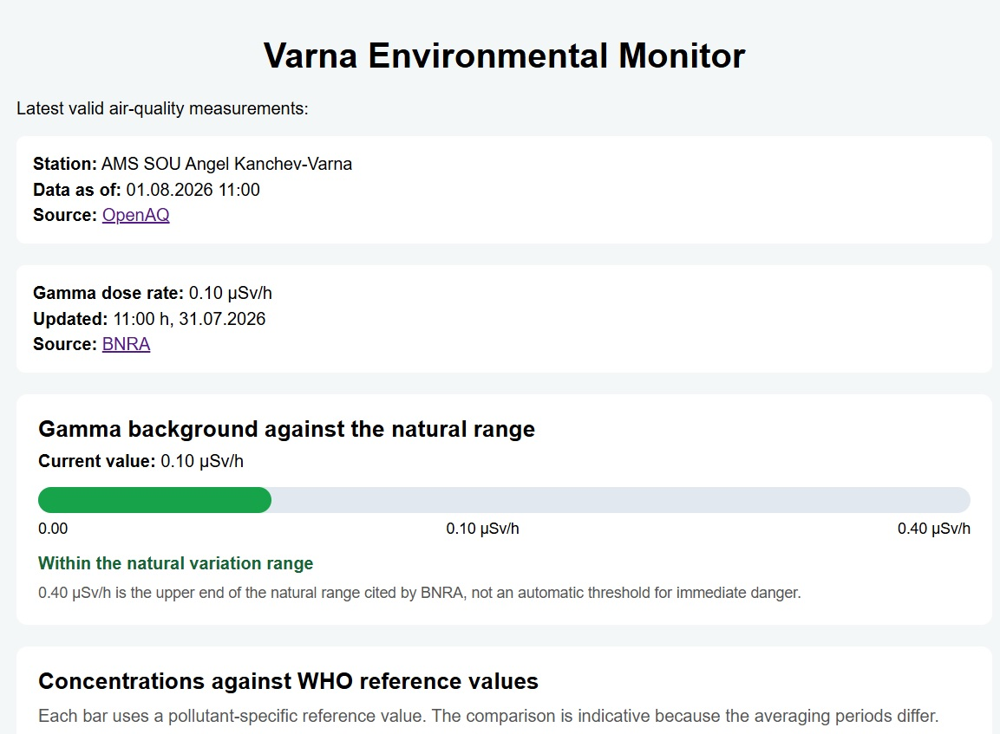
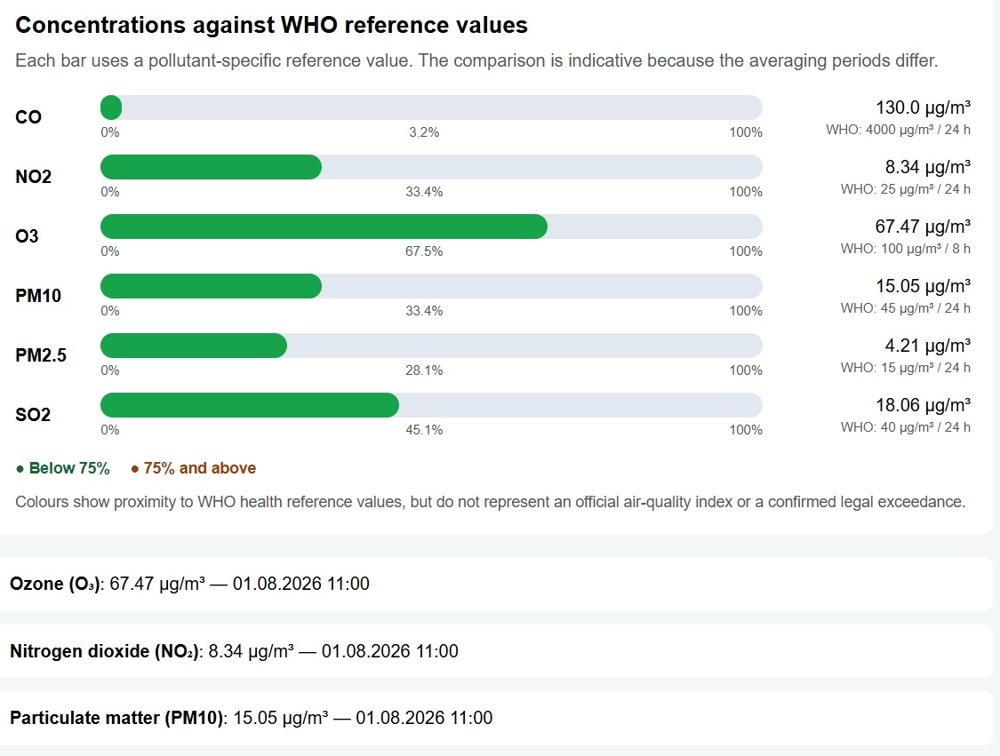
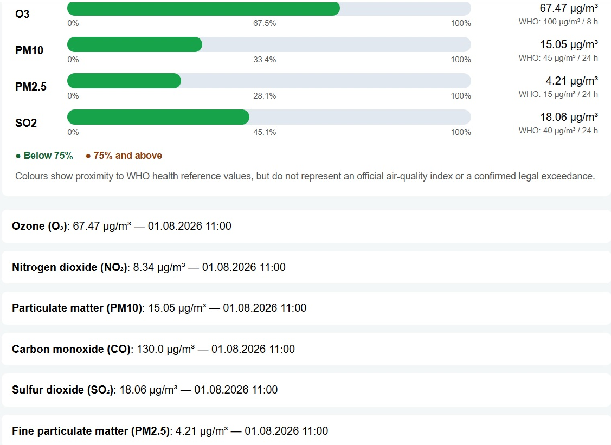

# Varna Environmental Monitor

An English-language Flask web application that retrieves, validates and visualizes environmental data for Varna, Bulgaria.

The application combines live air-quality measurements from the OpenAQ API with gamma dose-rate data published by the Bulgarian Nuclear Regulatory Agency.

## Overview

Varna Environmental Monitor demonstrates a complete environmental-data workflow:

- retrieving live data from external sources;
- validating and filtering measurements;
- handling API and network failures;
- using a local CSV dataset as a fallback source;
- parsing data from an official public webpage;
- preparing data for a Flask application;
- rendering environmental indicators with Jinja templates;
- visualizing measurements with HTML and CSS;
- protecting API credentials with environment variables;
- managing the project with Git and GitHub.

## Key features

- Live air-quality measurements from the OpenAQ API
- Gamma dose-rate data from the Bulgarian Nuclear Regulatory Agency
- Six monitored air pollutants
- Pollutant-specific WHO reference visualizations
- Validation of numeric values
- Filtering of negative, infinite and NaN measurements
- Selection of the latest valid measurement for each pollutant
- Local CSV fallback when OpenAQ is unavailable
- HTTP timeout and error handling
- Source links for OpenAQ and BNRA
- Measurement timestamps
- English-language interface
- Responsive HTML and CSS layout
- Secure API-key handling with `.env`
- Data-source exploration with Jupyter Notebook

## Data sources

### Air quality

Air-quality measurements are retrieved from the
[OpenAQ platform](https://openaq.org/).

The application uses OpenAQ location ID `8843` and retrieves:

- the latest measurements;
- sensor metadata;
- pollutant names;
- measurement units;
- local and UTC timestamps.

### Gamma dose rate

Gamma dose-rate data is extracted from the official
[Bulgarian Nuclear Regulatory Agency bulletin](https://bnra.bg/bg/byuletin-za-gama-fona/).

The application identifies the published row for Varna and extracts:

- the latest gamma dose-rate value;
- the measurement unit;
- the publication date;
- the publication time.

## Displayed pollutants

- Carbon monoxide — CO
- Nitrogen dioxide — NO₂
- Ozone — O₃
- Particulate matter — PM10
- Fine particulate matter — PM2.5
- Sulfur dioxide — SO₂

## Reference visualizations

Each air-quality measurement is displayed relative to its pollutant-specific WHO reference value.

The visual progress bars show how close the latest measurement is to the selected reference value:

- below or equal to 75% — green;
- above 75% — orange.

The progress bar is visually limited to 100%, while the calculated percentage remains available as text.

## Scientific limitations

The application displays the latest available air-quality measurements.

These instantaneous measurements are compared indicatively with health reference values whose official averaging periods may be 8 or 24 hours.

The visualization therefore does not represent:

- an official air-quality index;
- a regulatory assessment;
- a confirmed legal exceedance;
- a substitute for an officially calculated averaging period.

For gamma radiation, `0.40 µSv/h` is presented as the upper end of the natural range cited by BNRA. It is not treated as an automatic threshold for immediate danger.

## Main technologies

- Python 3.11
- Flask
- Requests
- BeautifulSoup
- python-dotenv
- OpenAQ API
- Jinja templates
- HTML
- CSS
- Jupyter Notebook
- Git
- GitHub

## Project structure

```text
varna_environment_monitor/
├── data/
│   └── openaq_varna_8843.csv
├── docs/
│   └── screenshots/
│       ├── air-quality-reference-chart.jpg
│       ├── dashboard-overview.jpg
│       └── measurement-cards.jpg
├── static/
│   └── style.css
├── templates/
│   ├── base.html
│   └── index.html
├── air_quality.py
├── app.py
├── ExploreOpenAQ.ipynb
├── ExploreRadiation.ipynb
├── radiation.py
├── README.md
├── requirements.txt
└── .gitignore
```

## File responsibilities

### `app.py`

- creates the Flask application;
- defines the home-page route;
- retrieves air-quality and radiation data;
- prepares WHO reference calculations;
- sends the prepared data to the HTML template.

### `air_quality.py`

- loads the OpenAQ API key securely;
- retrieves live measurements and sensor metadata;
- validates measurement values;
- selects the latest valid value for each pollutant;
- formats measurement timestamps;
- uses the local CSV dataset as a fallback source.

### `radiation.py`

- requests the official BNRA webpage;
- parses its HTML tables;
- identifies the Varna measurement;
- extracts the dose-rate value and update timestamp;
- returns a safe unavailable state when the source cannot be read.

### `templates/`

Contains the Jinja HTML templates used to render the web interface.

### `static/style.css`

Contains the page layout, card design, progress bars and responsive styling.

### `ExploreOpenAQ.ipynb`

Used to inspect the OpenAQ API response structure before implementing the production module.

### `ExploreRadiation.ipynb`

Used to inspect the BNRA webpage structure before implementing the HTML parser.

## Installation

Clone the repository and enter the project directory:

```powershell
git clone https://github.com/Lyub0-sys/varna-environmental-monitor.git
cd varna-environmental-monitor
```

Create a virtual environment:

```powershell
python -m venv .venv
```

Activate it in PowerShell:

```powershell
.\.venv\Scripts\Activate.ps1
```

Install the required packages:

```powershell
pip install -r requirements.txt
```

## Environment configuration

Create a local `.env` file in the project root:

```text
OPENAQ_API_KEY=your_openaq_api_key
```

The `.env` file is excluded from Git through `.gitignore`.

The API key must never be committed, displayed in the application or included in screenshots.

## Running the application

From the project directory, run:

```powershell
python app.py
```

Open the application in a browser:

```text
http://127.0.0.1:5000
```

## Data validation

Measurements are rejected when they are:

- missing;
- non-numeric;
- negative;
- infinite;
- NaN;
- associated with an unsupported pollutant;
- missing a valid timestamp.

The application currently displays only:

```text
co
no2
o3
pm10
pm25
so2
```

## Fallback behaviour

When the OpenAQ API cannot provide valid live measurements, the application loads the latest valid values from:

```text
data/openaq_varna_8843.csv
```

If the BNRA webpage cannot be retrieved or parsed, the rest of the Flask application continues running and reports that radiation data is temporarily unavailable.

## Screenshots

### Dashboard overview



### Air-quality reference chart



### Measurement cards



## Current status

The current version:

- runs locally as a Flask application;
- retrieves live OpenAQ measurements;
- retrieves live BNRA gamma dose-rate data;
- validates external data;
- provides a CSV fallback;
- displays six air pollutants;
- includes source links and timestamps;
- provides indicative WHO reference visualizations;
- uses an English-language interface;
- stores the API key outside the repository.